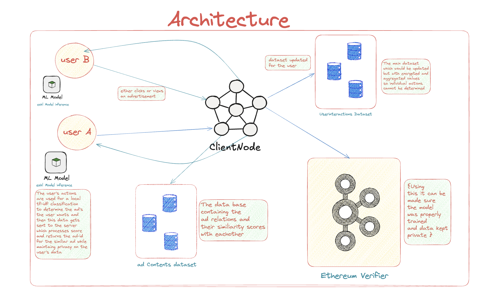

# ZkAdTrust

## Overview
Our zkML-based ad recommendation system leverages zero-knowledge proofs to deliver personalized ads while preserving user privacy. Instead of transmitting raw user data to a central server, all processing—such as updating local interaction datasets, computing TF-IDF embeddings, and generating similarity scores between ads—is performed on the client node. A proof generated using EZKL attests that the ads are displayed correctly, allowing the main server to verify ad delivery without accessing any sensitive information.

## Workflow Summary
- **User Interaction:** The user clicks on ads, which updates the local dataset.
- **Local Computation:** The client node uses a TF-IDF embedding model to compute similarity scores between ads based on local data.
- **Proof Generation:** A zero-knowledge proof is generated using EZKL, confirming that ads are being displayed according to user preferences.
- **Verification:** The generated proof is sent to the main server, which verifies it to ensure proper ad display without ever receiving or storing raw user data.

# Architecture

</img>

## Components
- **Client Node:**
  - **Local Data Store:** Holds a dataset of ads and records of user interactions.
  - **Processing Engine:** Computes TF-IDF embeddings and cosine similarity scores between ads.
  - **Proof Generator:** Uses EZKL to create zero-knowledge proofs that validate the ad selection process.
  
- **Main Server:**
  - **Verifier:** Receives and verifies the zero-knowledge proofs from the client nodes.
  - **Trust Anchor:** Ensures that ad recommendations comply with the system’s privacy-preserving rules without accessing the underlying user data.

## Data Flow
1. **User Interaction:** The user clicks on ads, triggering local data updates.
2. **Dataset Update:** The client node updates its local dataset with new user interactions.
3. **TF-IDF Embedding:** The updated dataset is processed to compute TF-IDF embeddings for the ads.
4. **Similarity Computation:** Cosine similarity scores are calculated to determine ad relevance.
5. **Proof Generation:** EZKL is used to generate a zero-knowledge proof confirming that the recommendations are derived from the correct computations.
6. **Proof Verification:** The proof is sent to the main server, which verifies it to ensure that ads are being displayed properly while maintaining user privacy.

# Pros and Cons

## Pros
- **Enhanced Privacy:** User data remains local; no raw data is transmitted to or stored on a central server.
- **Trustless Verification:** Zero-knowledge proofs enable the server to verify ad recommendations without accessing sensitive user data.
- **Regulatory Compliance:** The design supports compliance with privacy regulations like GDPR and CCPA.
- **Decentralization:** Reduces the risk associated with centralized data storage and potential breaches.
- **Transparency and Auditability:** Verifiable proofs ensure that ad delivery mechanisms can be audited and trusted by all parties.

## Cons
- **Computational Overhead:** Local computation of TF-IDF embeddings and proof generation may be demanding for some client devices.
- **Integration Complexity:** Incorporating zero-knowledge proofs into an existing ad platform can be complex and require significant development effort.
- **Scalability Challenges:** The performance on lower-end devices might be limited by hardware constraints.
- **Latency in Proof Generation:** The process of generating and verifying proofs could introduce delays in ad delivery.
- **Limited Flexibility:** The approach may be less adaptable to more sophisticated ad targeting methods that rely on fine-grained user data.

## Resources 

- https://www.geeksforgeeks.org/targeted-advertising-using-machine-learning/

- https://github.com/Azure/cortana-intelligence-personalization-data-science-playbook/blob/master/Personalized_Offers_from_Classifiers_Use_Case.md

- https://carpentries-incubator.github.io/python-text-analysis/05-tf-idf-documentEmbeddings/index.html
